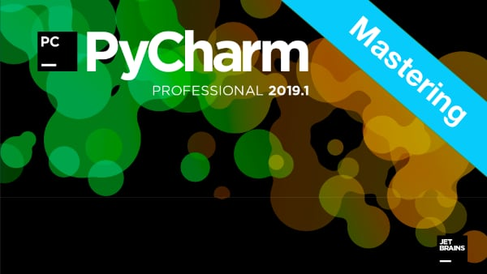

# Mastering PyCharm course

[Visit course page](https://training.talkpython.fm/courses/explore_pycharm/mastering-pycharm-ide)

## Resources

JetBrain's PyCharm cheat sheet

[PyCharm_Reference_Card.pdf](https://blog.jetbrains.com/pycharm/files/2010/07/PyCharm_Reference_Card.pdf)

## Course Summary

PyCharm is the premier Python IDE (integrated development environment). You will be hard pressed to find an editor that gives a more holistic way to build Python applications. While powerful, IDEs can be daunting to learn with all their features. That's why this course shows you how they all work.

## What's this course about and how is it different?

This course will teach you to be extremely proficient with PyCharm.

We dive deep into every aspect of the IDE. From project management and using the editor to advanced database management features and the refactoring tools, you will see PyCharm in action and try them out for yourself.

In this course, you will:

* Learn to manage Python projects in PyCharm (large and small)
* Create web applications (Pyramid, Flask, Django, and more)
* Use PyCharm's special data science mode
* Refactor your Python code with confidence
* Learn about code smells and duplicate code tooling
* Access git, github, and use git flow
* Use the visual debugger to understand code flow and state
* Make your code more reliable with unit testing and pytest
* Create new Python packages
* And lots more

View the [full course outline](https://training.talkpython.fm/courses/explore_pycharm/mastering-pycharm-ide#course_outline).

## Who is this course for?

For anyone who has never used PyCharm: You will see what a true Python IDE has to offer in a concrete and demo-focused tour de force.

Existing PyCharm users: Your IDE has a wealth of features that you might not even know exist. You will see and explore most of them in this course!

## Concepts backed by concise visuals

While exploring a topic interactively with demos and live code is very engaging, it can lose the forest for the trees. That's why when we hit a new topic, we stop and discuss it with concise and clear visuals.

Here's an example of concepts reviewing the database tools within PyCharm.

## Hands-on exercises for almost every chapter

Learning IDEs can be hard. There are just so many features. Unless you build that muscle memory with practice, most of them will be forgotten. Mastering PyCharm has hands-on exercises for almost every chapter of the course.

These exercises range in length from 10 minutes to about 30 minutes each.

Here is the your turn for the Refactoring chapter.

## Is this course based on Python 3 or Python 2?

Python 3, definitely.

Check out the **[course page](https://training.talkpython.fm/courses/explore_pycharm/mastering-pycharm-ide)** for more details.