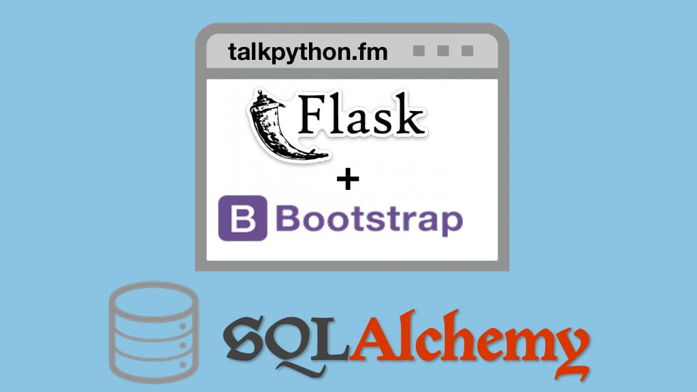

# Data-driven web apps with 

Course demo code and other hand-out materials for our data driven web apps in Flask course. Visit the full course page at **[training.talkpython.fm](https://training.talkpython.fm/courses/explore_flask/building-data-driven-web-applications-in-python-with-flask-sqlalchemy-and-bootstrap)**

## Course Summary

One of the areas Python really shines is in building clean and powerful web applications. Once you know the language basics, this course will teach you everything you need to build data-driven, modern web applications in Python with the Flask web framework.

## What's this course about and how is it different?

**Full stack web development is exactly what you need to build true data-driven web applications in Python**. Yet these courses can be confusing and overwhelming due to the many technologies involved (Python, SQL, CSS, etc).

We have taken great care to build a course that is **just real enough to give you what you need without anything extra**. We build a replica of a popular web application, Python's own packaging index over at pypi.org.

While building our replica PyPI, you will learn:

* Learn about the different major Python web frameworks
* Create a Flask-based website from scratch using the CLI and PyCharm
* Work with dynamic HTML templates
* Map URLs to view methods using routing
* Make advanced use of routing to build a full custom CMS in 8 minutes
* Take advantage of bootstrap to build well designed sites
* Map data to and from Python using classes with SQLAlchemy
* Learn how Alembic can help our database evolve as our models change
* Accept user input with HTML forms
* Add client and server-side validation
* Overcome the special challenges of testing web apps (databases, frameworks, etc)
* Deploy our web application to a fresh Linux machine (virtual, cloud-based)
* Leverage our design patterns to convert our app to another data model (MongoDB edition)

## Who is this course for?

This course is for **anyone who wants to create Python-based web applications using the Flask web framework**. In fact, you'll learn a lot of web skills that will translate across frameworks as well.

We do assume that you have basic Python language skills and can read HTML and CSS. But most advanced uses of the language or CSS are explained in the course.

## Is this course based on Python 3 or Python 2?

This course is **based upon Python 3**. With Python 2 going unsupported in 2020, we believe that it would be ill-advised to teach or learn Python 2.

## The time to act is now

This **data-driven web apps with Python and Flask** course is just what you need to build that fast, custom web application that can help you create your next great idea or just solve a business problem by deploying it behind your firewall.

Take the course over at **[training.talkpython.fm](https://training.talkpython.fm/courses/explore_flask/building-data-driven-web-applications-in-python-with-flask-sqlalchemy-and-bootstrap)**.