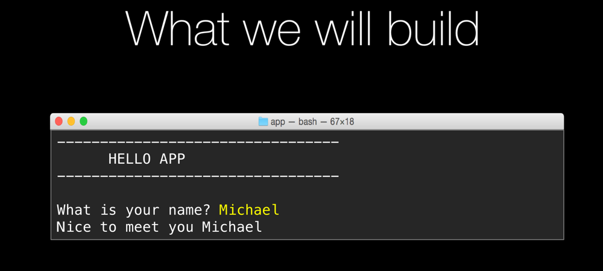

# App 1: Hello world

If you want to try this yourself, try to build the interactive app above. 

The WHITE text is output from the program. The YELLOW input is what the users types.

Key concepts
=================

* `print('text')`
* `text = input('prompt for user')`
* strings are combined via `+`

Note: While this may seem super simple (and may be depending on your experience), it's as much about testing that you have PyCharm, Python, and your environment working as it is about the code we write.

