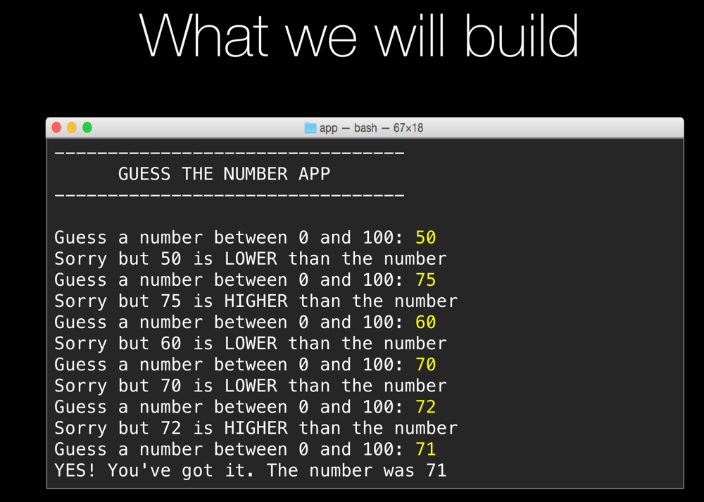

# App 2: Guess my number game

If you want to try this yourself, try to build the interactive app above. 

The WHITE text is output from the program. The YELLOW input is what the users types.

Key concepts introduced
=================

**String formatting**

`"Your number was {}.".format(num)`

**Conditionals**

    if TEST:
        conditional code
        conditional code
    elif TEST:
        conditional code
    else:
        conditional code
        
**Loops**

    while TEST:
        loop code
        loop code
        loop code

**importing modules**

    import os
    print(os.sys.version)
    
**random numbers**

Random numbers are generated using the `randint()` method in the random module. You'll need to import random, and then call `random.randint(low, high)`.
