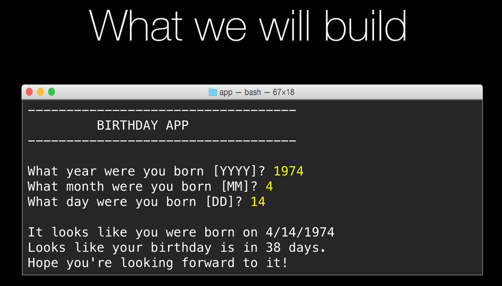

# App 3: Birthday countdown app

If you want to try this yourself, try to build the interactive app above. 

The WHITE text is output from the program. The YELLOW input is what the users types.

Be sure to try three cases:

* When your birthday is coming later this year
* On the day it is your birthday
* When your birthday has already occurred this year

Key concepts introduced
=================

**Functions**

    def my_function(input1, input 2):
        line 1
        line 2
        line 3
        
        return value

**Dates, times, and time spans**

All of these come from the module `datetime`.

* `datetime.date # actual date class`
* `datetime.timedelta # class for time spans`
* The time right now is `datetime.date.today()`
* The difference between two dates is done via subtraction: `delta = t1 - t0`
* `delta.days` may be helpful ;)

