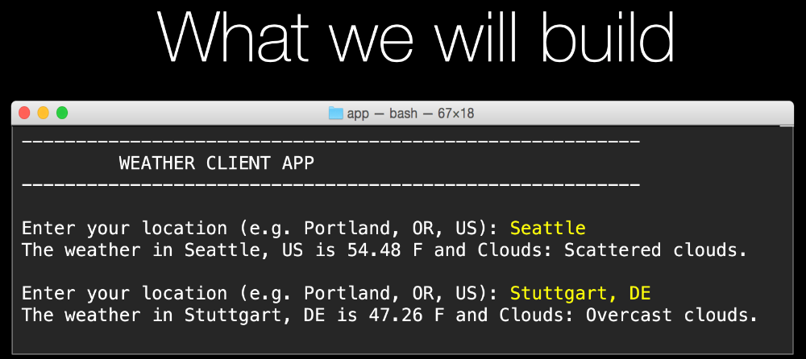

# App 5: Weather client app

If you want to try this yourself, try to build the interactive app above. 

The WHITE text is output from the program. The YELLOW input is what the users types.

This application will ask the user for their zip code. Then you will use this zip code, the requests and beautiful soup 4 PyPI packages to download a weather web page, scrape out the relevant info and display it back on the console.

Note: If you visit [wunderground.com](https://www.wunderground.com) today and search for a location, it no longer uses the zipcode as clearly in the URL. For example, my local report is [wunderground.com/weather/us/or/portland](https://www.wunderground.com/weather/us/or/portland). However, the URL in the code and demos still works entirely well. It's just not publicly used on the site. For example, this URL is fine: 

[http://www.wunderground.com/weather-forecast/92018](http://www.wunderground.com/weather-forecast/92018)

Key concepts introduced
=================

**Python Package Index (PyPI)**

[https://pypi.python.org/pypi](https://pypi.python.org/pypi)

**pip**

    pip3 list
    pip3 install requests

**Requests package**

Quick start: [http://docs.python-requests.org/en/master/user/quickstart/](http://docs.python-requests.org/en/master/user/quickstart/)

**Beautiful soup package**

Quick start: [http://www.crummy.com/software/BeautifulSoup/bs4/doc/#quick-start](http://www.crummy.com/software/BeautifulSoup/bs4/doc/#quick-start)

**tuples**

    # Create a tuple
    m = (22.5, 44.234, 19.02, 'strong')

    temp = m[0]      # 22.5
    quality = m[3]   # 'strong'

    print(m) # (22.5, 44.234, 19.02, 'strong')

    # tuple unpacking
    t, la, lo, q = m

**namedtuples**

    import collections
    
    # Define a named tuple 'type'
    Measurement = collections.namedtuple('Measurement', 
    'temp, lat, long, quality')
 
    # Create an instance of that type of named tuple
    m = Measurement(22.5, 44.234, 19.02, 'strong')

    temp = m[0]          # old skool
    temp = m.temp        # new hotness
    quality = m.quality  # new hotness

    print(m)
    # Measurement(temp=22.5, lat=44.234, 
        long=19.02, quality='strong')
