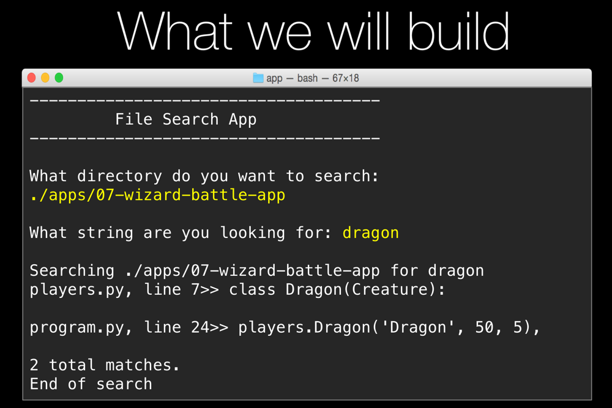

# App 8: File Searcher App

 
If you want to try this yourself, try to build the interactive app above. 

This application will search for text within an entire directory tree (files in a directory or any subdirectory). 

Key concepts introduced
=================

**Recursion**

Reclusive methods are perfect for processing hierarchical data structures (such as directories containing subdirectories and files). 

Here is a simple recursive method calling itself to compute the factorial of a number which is defined inductively (or recursively)

    def factorial(n):
        if n <= 1:
            return 1

        return n * factorial(n - 1)

**Generator methods**

Generator methods let us process sets or collections of data without first loading the entire data set. Rather, each yield pauses the method, let's the consumer process it, and optionally continue running the method.

    def fibonacci():
        current = 0
        next = 1

        while True:
            current, next = next, next + current
            yield current

    for n in fibonacci():
        if n > 1000:
            break
        print(n)
