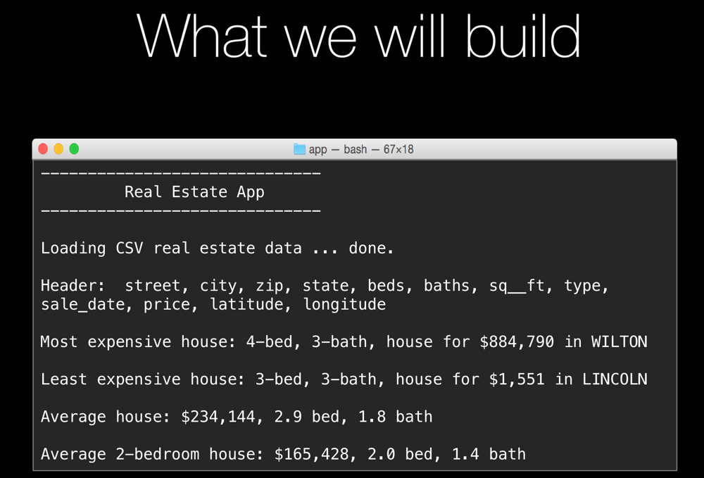

# App 9: Real Estate Analyzer App

 
If you want to try this yourself, try to build the interactive app above. 

This application will load a CSV file of real estate data and then answer several questions by processing the data using list comprehensions and generator expressions.

* What is the **most** expensive house sold that year?
* What is the **least** expensive house sold that year?
* What are the features of an *average* house?
* What are the features of an *average **2-bedroom*** house?

Key concepts introduced
=================

**Dictionaries**

Dictionaries are data structures which allow random access by a key (string, number, whatever). They are extremely common and powerful in Python.

    info = dict()  # {}
    info['age'] = 42
    info['loc'] = 'Italy'

    info = dict(age=42, loc='Italy')
    info = {'age': 42, 'loc': 'Italy'}

    location = info['loc']

    if 'age' in info: 
        # use info['age']

**Lambdas**

Lambdas are small inline methods.

    def find_sig_nums(nums, predicate):
        for n in nums:
            if predicate(n):
                yield n

    numbers = [1, 1, 2, 3, 5, 8, 13, 21, 34]
    sig = find_sig_nums(numbers, lambda x: x % 2 == 1)
    # sig -> [1, 1, 3, 5, 13, 21]

**CSV File Parsing**

    def load_file(filename):
        with open(filename, 'r', encoding='utf-8') as fin:
            reader = csv.DictReader(fin)
            purchases = []
            for row in reader: # row is a dictionary
                purchases.append(row)

        return purchases

**py2 vs py3**

    try:
        import statistics # only Python 3.4.3+
    except:
        # statitics_2_stand_in defines a mean method
        import statitics_2_stand_in as statistics

    # Can use statistics.mean as needed
    
    numbers = [1, 6, 99, ..., 5]
    the_ave = statistics.mean(numbers)

**List comprehensions**

    paying_usernames = [
        u.name
        for u in get_active_customers()
        if u.last_purchase == today
    ]
    # paying_usernames is a list

**Generator expressions**

    paying_usernames = (
        u.name
        for u in get_active_customers()
        if u.last_purchase == today
    )
    # paying_usernames is a generator

------------------

Note: To see finished code that outputs the expected 
numbers, you can use this alternate branch:

App 9's [program.py](https://github.com/mikeckennedy/python-jumpstart-course-demos/blob/app_9_matching_output/apps/09_real_estate_analyzer/final/program.py)
 for this "you try" section