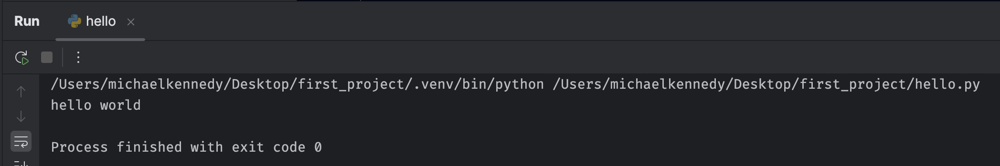
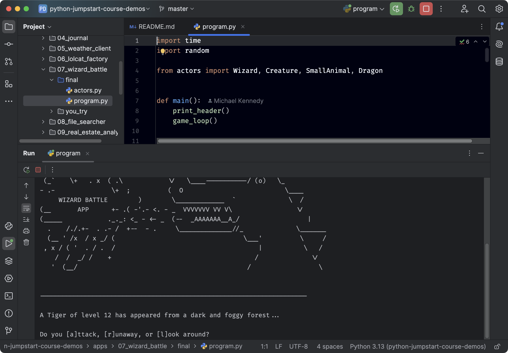

# Your turn: Projects

## Objectives

1. Create a new project and run it
2. Open and configure an existing (semi) complex project

## Create a new project

To create a new project, use PyCharm's new project wizard. 

Steps:

1. Create a folder to hold your project and virtual environment. Create a folder called `first_project` wherever you would like to keep your PyCharm projects.
2. Install **uv** (from [https://docs.astral.sh/uv/getting-started/installation/](https://docs.astral.sh/uv/getting-started/installation/)). **uv** is an important somewhat new tool for managing Python versions and virtual environments. Listen to [my interview with Charle Marsh](https://talkpython.fm/episodes/show/476/unified-python-packaging-with-uv) if you want to dive deep into that. We'll be using this to install Python and create a virtual environment.
3. Open a terminal (using Windows Terminal if you happen to be on Windows) in the `first_project` folder.
4. Run the command to both install Python and create the virtual environment  here:
   `uv venv --python 3.13.2 --python-preference only-managed` (update this to use the latest version of Python, for me it's 3.13.2 as of this writing).
5. Open PyCharm
6. Choose **File > Open ...** and browse to select the `first_project` folder.
7. Add a `hello.py` file to the project by right-clicking and adding 'python' style file.
8. Print *hello world*
9. Run within PyCharm (right-click on `hello.py` in the project window and choose `Run 'hello'`)
10. Verify that the virtual environment's version of Python was used (see Python path in the second image below)



## Configure a complex project

In this section, you'll check out the Python Jumpstart by Building 10 Apps demo content. Just clone it from the repository here:

[https://github.com/talkpython/python-jumpstart-course-demos](https://github.com/talkpython/python-jumpstart-course-demos)

```shell
git clone https://github.com/talkpython/python-jumpstart-course-demos
```

If you don't _git_, that's OK. Just download and unzip it (click the `Code` button then download as zip).

Open a terminal again, and cd into `python-jumpstart-course-demos`. Create another virtual environment (same command as before):

```bash
uv venv --python 3.13.2 --python-preference only-managed
```

And then open `python-jumpstart-course-demos` as a project in PyCharm. Just choose `File > Open...` and browse to the file.

You will want to configure the wizard battle section to work correctly with the relative imports. Mark this directory as a **Sources Root**:

`./apps/07_wizard_battle/final/`

Then configure PyCharm to run `program.py` in that folder (right-click on `program.py` and chose run).

You should also have no errors around this statement in the PyCharm editor. This will indicate that the sources root settings are configured correctly.

	# program.py, line 4
	from actors import Wizard, Creature, SmallAnimal, Dragon

Run it and enjoy your wizard battle. Good luck with the dragon!



*See a mistake in these instructions? Please [submit a new issue](https://github.com/talkpython/mastering-pycharm-course/issues) or fix it and [submit a PR](https://github.com/talkpython/mastering-pycharm-course/pulls).*
