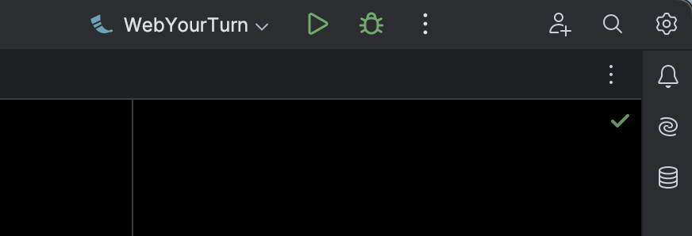
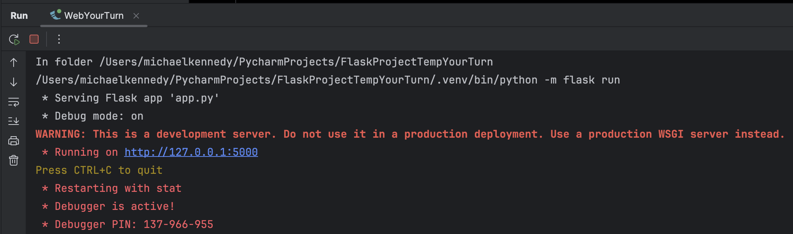
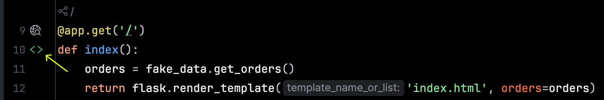
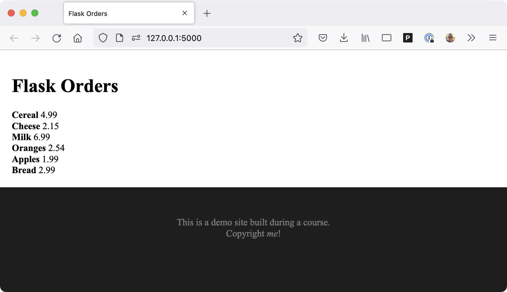

# Your turn: Web

## Version warning

This chapter requires PyCharm Professional to complete as indicated. Please see the [version breakdown](https://www.jetbrains.com/pycharm/editions/) at JetBrains.

## Objectives

1. Create a basic Flask web app
2. Implement a view method
3. Render data from view in the template
4. Change the global site look and feel

## Creating a new Flask web app

We are going to use PyCharm's tools to create a Flask web app.

We'll let PyCharm create most of this for us at the start.

1. Open PyCharm
2. Choose "Create new project"
3. Pick Flask
4. Expand the "Project interpreter"
5. Verify you're using Python 3.9 or higher in a virtual environment.
4. Expand the "More settings" section.
5. Make sure the template language is `Jinja2`
6. Name your project and create it

Now that you have the project created, PyCharm will have already installed Flask and its dependencies in the virtual environment it created for you.  Moreover, it has configured Flask to run with the flask CLI commands rather than Python's native style (e.g. `flask run` rather than `python3 app.py`).



1. Unfortunately, at the time of writing, PyCharm "forgets" to add `FLASK DEBUG` to the run configuration. Edit the configuration (**WebYourTurn** in this screenshot), click on **Modify options**, and check `Flask Debug` then close the window. This allows for the reloading of the web templates and web app as you edit them making it easier iterate while developing.

At this point, you'll have the typical "hello world" Flask app:

```python
from flask import Flask

app = Flask(__name__)

@app.route('/')
def hello_world():  # put application's code here
    return 'Hello World!'

if __name__ == '__main__':
    app.run()
```

Go ahead and run the app by pressing the green arrow in the screenshot above. You should see something like this:



## Implement a data-driven view method

Let's add a little structure. Create a top-level folder called `data`. In the `data` folder, create called `fake_data.py`. Copy this method into that file:

```python
def get_orders():
    return [
        {'name': 'Cereal', 'price': 4.99},
        {'name': 'Cheese', 'price': 2.15},
        {'name': 'Milk', 'price': 6.99},
        {'name': 'Oranges', 'price': 2.54},
        {'name': 'Apples', 'price': 1.99},
        {'name': 'Bread', 'price': 2.99},
    ]
```

Now let's use it in the website.

We're going to *replace* the `hello_world()` view method with one called `index()`. Traditionally, website's default file served has been `index.html` for urls such as `https://the_server.com/` where no file was specified. So we'll mirror that in the Flask style by naming our view method `index()`.

Additionally, let's get the data from our simulated database (`fake_data.py`) into the view method. Import `fake_data` and use it to store the orders in a local variable.

The final view method should look like this:

```python
@app.get('/')
def index():
    orders = fake_data.get_orders()
    return 'Hello World!'
```

Go ahead and run the app again and request the home page just to make sure things are still hanging together. If it was already running, you can expand the run console in the lower section and you will see it already restarted the app. So you wouldn't even need to restart it, just refresh your browser. 

You might also consider checking out my [server-hot-reload](https://github.com/mikeckennedy/server-hot-reload) project to automate that further.


## Render data in an HTML template

Now you have the data ready to send along to the HTML side of things, let's create the Jinja template and render the orders there.

Create a new HTML file: `templates/index.html` (this should use PyCharm's HTML template with a little structure). Now it's time to use Jinja's syntax to render the orders. The Jinja code section for the orders should look something like this:

```html
<!-- ... -->
<h1>Flask Orders</h1>


    <div>
        <span style="font-weight: bold;">{{ o.name }}</span>
        <span>{{ o.price }}</span>
    </div>

<!-- ... -->
```

Do not copy / paste this. Type it in to see how PyCharm helps you with autocomplete and more.

Finally, we'll jump back to our `index()` view method and render the template with the order data using Flask's `flask.render_template()` method:

```python
@app.route('/')
def index():
    orders = fake_data.get_orders()
    return flask.render_template('index.html', orders=orders)
```

With this code in place, you should now have a nav icon to jump between the view method and template:



## Global look and feel with a shared template

Finally, let's see how we go about having a common look-and-feel across the site. 

Create a new HTML file that will hold the outer "shell" of our site with a common set of imports, styles, navigation, footers, and so on. Create `templates/_layout.html`. I like the `_` prefix to indicate it's not a public page but a shared item.

Add HTML like below in there. Note the `block` keyword to allow us to use this across other pages. Also, we threw in some styles just to make the effect of the template more obvious. In real apps, you'd put that in a style sheet, but we want to keep this simpler if possible for this walk-through.

```html
<!DOCTYPE html>
<html lang="en">
<head>
    <meta charset="UTF-8">
    <title>Flask Orders</title>
</head>
<body style="margin: 0px; background-color: #222; ">

<div style="padding: 20px; background-color: white; line-height: 1.5em;">
    
</div>

<footer style="color: #888; margin-top: 50px; text-align: center;">
    <div class="copyright">
        This is a demo site built during a Talk Python course.<br>
        Copyright <em>me</em>!
    </div>
</footer>

</body>
</html>
```

Finally, update the `index.html` file to use this template. Note that this is the entire page contents:

```html



<h1>Flask Orders</h1>


    <div>
        <span style="font-weight: bold;">{{ o.name }}</span>
        <span>{{ o.price }}</span>
    </div>



```

Be sure to run and inspect your new site! It should look somewhat like this.



*See a mistake in these instructions? Please [submit a new issue](https://github.com/talkpython/mastering-pycharm-course/issues) or fix it and [submit a PR](https://github.com/talkpython/mastering-pycharm-course/pulls).*
