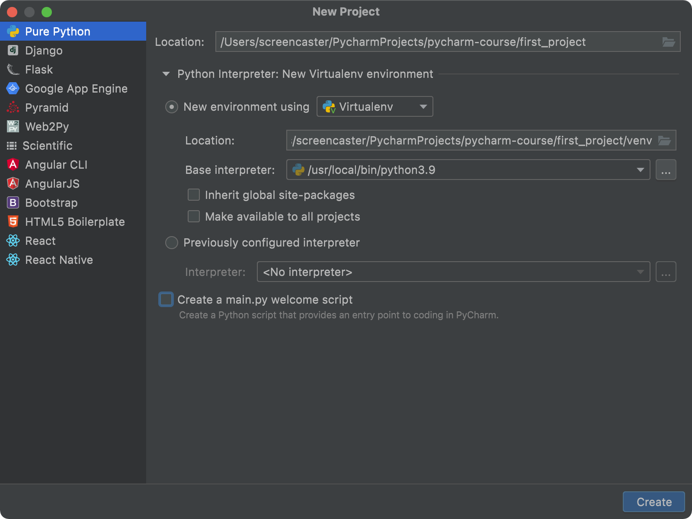
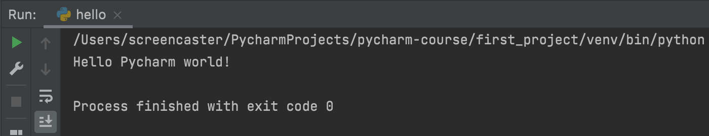
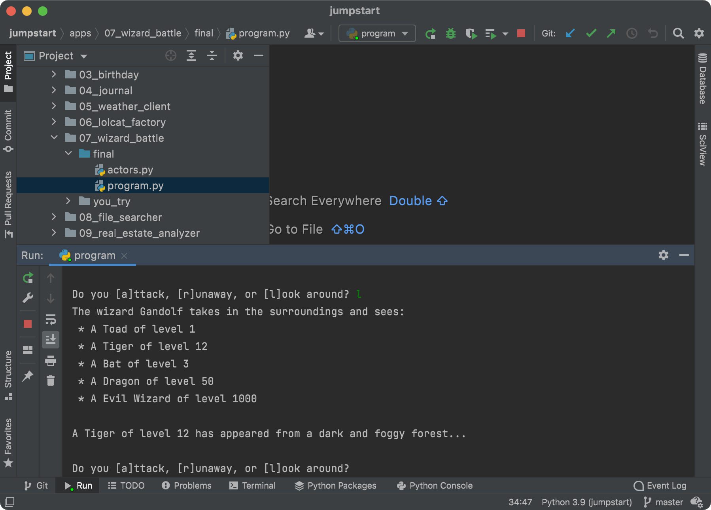

# Your turn: Projects

## Objectives

1. Create a new project and run it
2. Open and configure an existing (semi) complex project

## Create a new project

To create a new project, use PyCharm's new project wizard. 

Note that since the initial recording, PyCharm has changed the creation process to emphasize using virtual environments nested within the project folder.

Steps:

1. Open PyCharm
2. Create a new project
3. Name it first_project and use a virtual environment (see image below)
4. Add a hello.py
5. Print *hello world*
6. Run within PyCharm
7. Verify that the virtual environment's version of Python was used (see image)

## Configure a complex project

In this section, you'll checkout the Python Jumpstart by Building 10 Apps demo content. Just clone it from the repository here:

https://github.com/mikeckennedy/python-jumpstart-course-demos

If you don't git, that's OK. Just download and unzip it.

Before you open it with PyCharm, you'll want to create a virtual environment within it at the level you'll be opening the directory.

Change into the folder `python-jumpstart-course-demos`. Run the python 3 environment command (use `python.exe` on Windows):

`python3 -m venv --copies .env`

Then open `python-jumpstart-course-demos` as a project in PyCharm.

You will want to configure the wizard battle section to work correctly with the relative imports. Mark this directory as a **sources root**:

`./apps/07_wizard_battle/final/`

Then configure PyCharm to run `program.py` in that folder.

You should also have no errors around this statement in the PyCharm editor.

	# program.py, line 4
	from actors import Wizard, Creature, SmallAnimal, Dragon

Run it and enjoy your wizard battle. Good luck with the dragon!

*See a mistake in these instructions? Please [submit a new issue](https://github.com/talkpython/mastering-pycharm-course/issues) or fix it and [submit a PR](https://github.com/talkpython/mastering-pycharm-course/pulls).*
