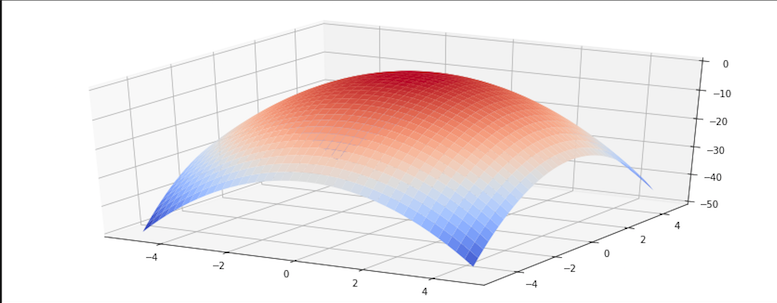
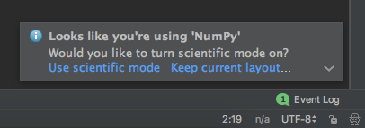
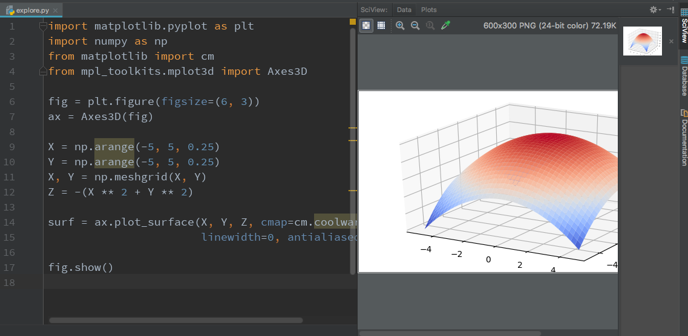
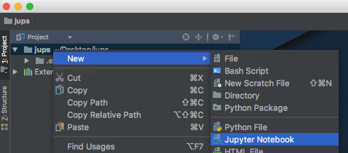
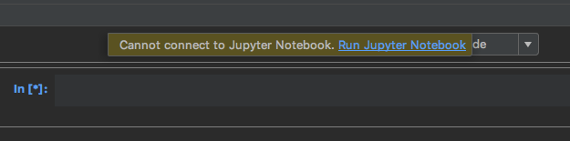
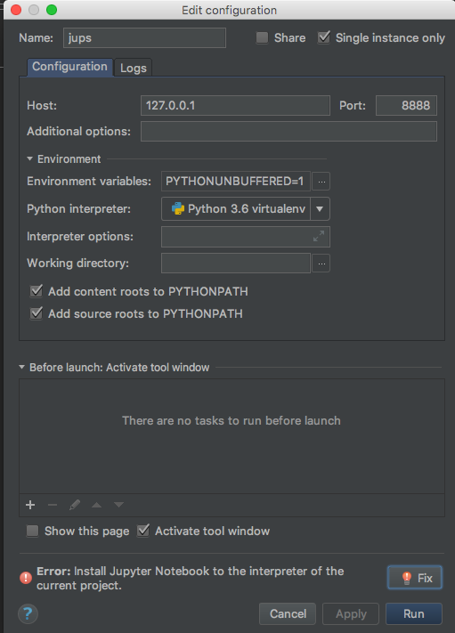
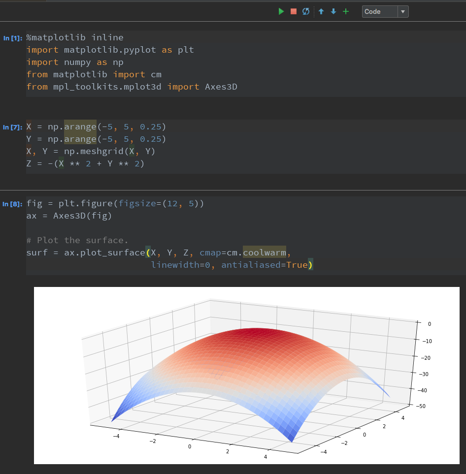

# Your turn: Data science

## Version warning

This chapter requires PyCharm Professional to complete as indicated. Please see the [chart for version breakdown](https://training.talkpython.fm/courses/explore_pycharm/mastering-pycharm-ide#editions) in the public course page.

## Objectives

1. Use PyCharm's data science mode
2. Draw pretty graphs over data
3. Use Jupyter notebooks

## Use PyCharm's data science mode

Create a new project with a dedicated virtual environment. We are going to first use data science mode for standard python and focus on Juypter notebooks at the end.

Create a new file python and run it to make a run configuration for it. So far, standard PyCharm.

Now we want to draw this graph. We'll use `pandas` and `matplotlib` to do so.



We are going to import a few libraries in this file. Put this at the top of the file. Have PyCharm install matplotlib via a code intention.

```python
import matplotlib.pyplot as plt
```

Next, **TYPE** this.

```python
import numpy as np
```

Notice the science mode has appear as a recommendation, use it:



Add the remaining imports:

```python
from matplotlib import cm
from mpl_toolkits.mplot3d import Axes3D
```

## Draw pretty graphs over data

Time to make a 3D parabolic surface. We'll use NumPy's cool array types to make this easy and *loopless*.

```python
fig = plt.figure(figsize=(6, 3))
ax = Axes3D(fig)

X = np.arange(-5, 5, 0.25)
Y = np.arange(-5, 5, 0.25)
X, Y = np.meshgrid(X, Y)
Z = -(X ** 2 + Y ** 2)
```

You may get a warning about `np.arange`, ignore it. It's fine.

Click onto various methods and see the documentation roll in.

Finally, plotting this.

```python
surf = ax.plot_surface(X, Y, Z, cmap=cm.coolwarm,
                       linewidth=0, antialiased=True)

fig.show()
```

Run this code and you should see it graphed on the right.



## Use Jupyter notebooks

Let's try that again in Juypter notebooks. Add a new notebook.



Now everything seems Ok, but some work needs to be done to get this ready. We'll just try to plow through and PyCharm will jump in where needed.

In the first cell, put this code (basically the same other than the matplotlib command).

```python
%matplotlib inline
import matplotlib.pyplot as plt
import numpy as np
from matplotlib import cm
from mpl_toolkits.mplot3d import Axes3D
```

Press the Juypter play button in the middle. It probably won't work. Hit cancel at the dialog and you'll see:



Click "run juypter notebook". Now the dialog pops up, but with a problem (see "fix" at the bottom - click it). It will take awhile.



Once it's done, click Run.


Now, back to the play button in the middle. Click it and now it should work.

In the next cell that appears, enter 

```python
X = np.arange(-5, 5, 0.25)
Y = np.arange(-5, 5, 0.25)
X, Y = np.meshgrid(X, Y)
Z = -(X ** 2 + Y ** 2)
```

Run that. Now plot it in the next cell:

```python
fig = plt.figure(figsize=(12, 5))
ax = Axes3D(fig)

# Plot the surface.
surf = ax.plot_surface(X, Y, Z, cmap=cm.coolwarm,
                       linewidth=0, antialiased=True)
```

Note that we don't need show() this time.

Now you have a fancy Juypter notebook with a graph!



*See a mistake in these instructions? Please [submit a new issue](https://github.com/talkpython/mastering-pycharm-course/issues) or fix it and [submit a PR](https://github.com/talkpython/mastering-pycharm-course/pulls).*
