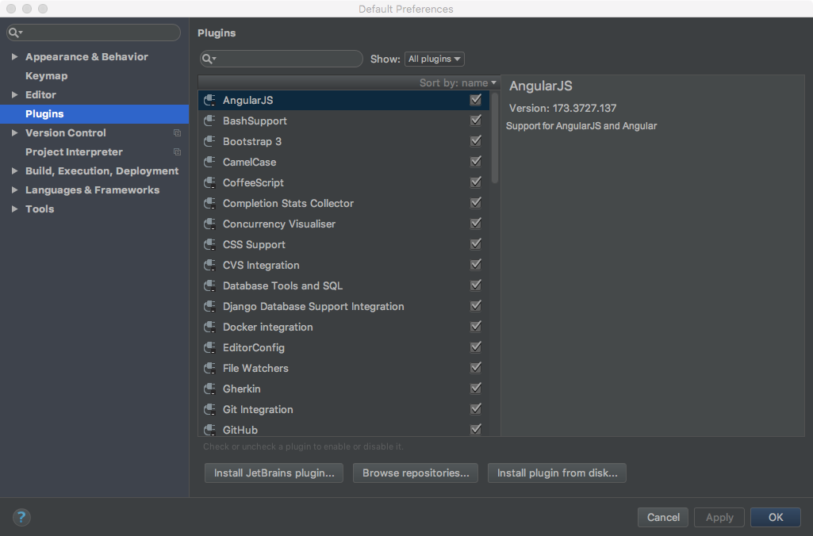

# Your turn: Plugins

## Objectives

* Explore existing plugins
* Discover new plugins
* Try 5 new ones

## Explore existing plugins

First, look around the existing plugins that make up PyCharm. Open preferences / settings and find the plugins section.

Click through them and see their descriptions on the right.

## Discover new plugins

In that same dialog, press `Browse repositories`. Use the search field to explore things you don't already have.

## Try 5 new ones

Choose 5 plugins from the browse area and install them and see what they have to offer. Have fun. You can always disable or uninstall them later.

*See a mistake in these instructions? Please [submit a new issue](https://github.com/talkpython/mastering-pycharm-course/issues) or fix it and [submit a PR](https://github.com/talkpython/mastering-pycharm-course/pulls).*
