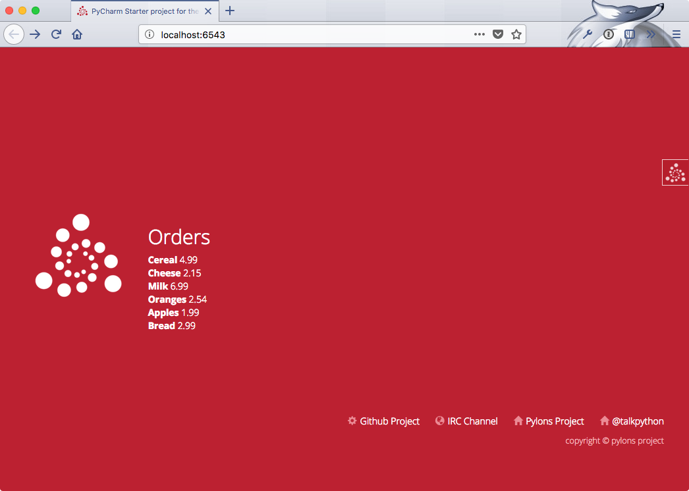

# Your turn: Web

## Version warning

This chapter requires PyCharm Professional to complete as indicated. Please see the [chart for version breakdown](https://training.talkpython.fm/courses/explore_pycharm/mastering-pycharm-ide#editions) in the public course page.

## Objectives

1. Create a basic Pyramid web app
2. Implement a view method
3. Render data from view in the template
4. Change the global site template

## A basic Pyramid web app

We are going to use PyCharm's tools to create a Pyramid web app. Alternatively you could use their cookiecuttter templates. But let's see what PyCharm has to offer.

We'll let PyCharm create most of this for us at the start.

1. Open PyCharm
2. Choose "Create new project"
3. Pick Pyramid
4. Expand the "Project interpreter"
5. Verify you're using Python 3.5 or higher in a virtual environment.
4. Expand the "More settings" section.
5. Change the template language to "Chameleon"
6. Name your project and create it

Now that you have the project created, PyCharm will suggest to "Install the project for development". Do that and the missing dependencies will vanish too.


## Implement a view method

Let's add a little structure. Create a file *next* to `views.py` called `fake_data.py`. Copy this method into that file:

```python
def get_orders():
    return [
        {'name': 'Cereal', 'price': 4.99},
        {'name': 'Cheese', 'price': 2.15},
        {'name': 'Milk', 'price': 6.99},
        {'name': 'Oranges', 'price': 2.54},
        {'name': 'Apples', 'price': 1.99},
        {'name': 'Bread', 'price': 2.99},
    ]
```

Now let's use it in the view.

Call this method from `views.py`. Add an entry to the dictionary being returned in that method. Call the value 'orders' and set the value to the result of this method.

While you are here, tell PyCharm you don't care that `request` is not used. Change this:

`def my_view(request):`

to

`def my_view(_):`

## Render data in the template

Now you have data delivered to `templates/mytemplate.pt`, let's render it. Find the section `<div class="content">` replace the contents inside with this:

```html
<div class="content">
	<h2>Orders</h2>
	<div tal:repeat="o orders">
		<div>
		    <span style="font-weight: bold;">${o.name}</span>
		    <span>${o.price}</span>
		</div>
	</div>
</div>
```

Do not copy / paste this. Type it in to see how PyCharm helps you.

## The global site template

Finally, let's see how we go about working across the site. Open `templates/layout.pt`. See the section with github, IRC, and Pylons? We want to add a twitter link to ALL pages on the site.

Add something like this in there:

```html
<li>
    <i class="glyphicon glyphicon-home icon-muted"></i><a 
        href="http://twitter.com/talkpython">@talkpython</a>
</li>
```

Note that this page is reused across pages because they start with this (e.g. `templates/mytemplate.pt`):

```html
<div metal:use-macro="load: layout.pt">
    <div metal:fill-slot="content">
	</div>
</div>
```

Be sure to run and inspect your new site! It should look somewhat like this.



*See a mistake in these instructions? Please [submit a new issue](https://github.com/talkpython/mastering-pycharm-course/issues) or fix it and [submit a PR](https://github.com/talkpython/mastering-pycharm-course/pulls).*
