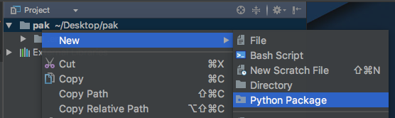

# Your turn: Packaging

## Objectives

1. Create a project
2. Make it a package
3. Add a feature
4. Include a setup
5. Use the package

## Create a project

We are going to create the file structure of a package. That usually looks something like this:

```
project_folder
   |
   |- package
       | - __init__.py
       | - source_file1.py
       | - source_file2.py
       | - ...
   |- package definition file 1
   |- package definition file 2
   |- package definition file ...
   |- setup.py
```

You'll want *room* in your top level directory for those management files (e.g. license, readme, setup.py). So we are going to create `project_folder` as a PyCharm project.

For this section:

1. Create a folder called `calcy_package`
2. Create a virtual environment called .env in that folder
3. Open it in PyCharm

## Make it a package

Use PyCharm's "create package" feature to create the package implementation itself. Name it **`calcy`** as in calculator.



Notice it created the empty `__init__.py` for you and the folder icon is slightly different to indicate a package.

## Add a feature

We'll add a couple of simple math methods to our calculator. Create another Python file in the folder called `math.py` and add an `add(x, y)` and `subtract(x, y)` pair of methods to `math.py`.

To make importing it easier, add this line to `__init__.py`:

```python
from calcy import math
```

That means you can consume it by typing `import calcy` then calling `calcy.math.add(7, 11)`.

Use the Python Console in PyCharm to test this (it adds the necessary path adjustments to run the package):

```python
import sys; print('Python %s on %s' % (sys.version, sys.platform))
sys.path.extend(['/Users/mkennedy/Desktop/pak'])
```

Here's one way to test it:

```python
import calcy
calcy.math.add(7, 5)
12
```

## Include a setup

It's great you can run your code locally. But for real packages, you'll need to be able to install it for consumers. To do this, we need a `setup.py`. 

Luckily, PyCharm has our back. Choose `Tools > Create setup.py` and fill in the dialog. Most values are somewhat irrelevant. But name the package `calcy`.

PyCharm may go overboard and include a bunch of stuff in the virtual environment. Just cut that out but leave:

```python
packages=['calcy']
```

## Use the package

Now let's install the package. Open a terminal / shell. Activate the virtual environment in the project folder:

```
# mac / linux
. .env/bin/activate 
```

```
Windows
.env/scripts/activate
```

Now run `setup.py` **from the same directory** as it is in:

```
python3 setup.py develop
```

Now change out of that folder to somewhere else. Run Python 3 and try to import and use it:

```
$ python3
import calcy
calcy.math.add(7, 5)
12
```

You've got it working!

*See a mistake in these instructions? Please [submit a new issue](https://github.com/talkpython/mastering-pycharm-course/issues) or fix it and [submit a PR](https://github.com/talkpython/mastering-pycharm-course/pulls).*
